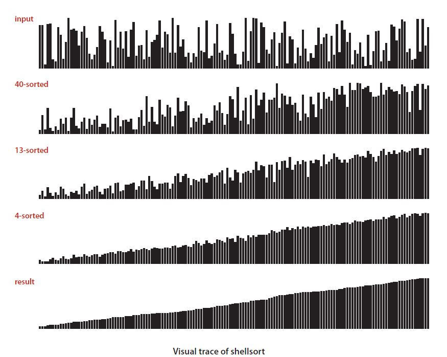

# sorAlg
This dir. is going to be dedicated to developing a comprehensive understanding of sorting algorithms.
I would like to code up pre-existing algorithms and potentially design my own. 

### *Goals:*
- [ ] Understand Big 'O' Notation
- [ ] Programme a simple sorting algorithm
- [ ] Progress to more complex algorithms
- [ ] Design my own sorting algorithm
- [ ] Develop a sorting visualiser (refer to fig.1)
- [ ] ...

